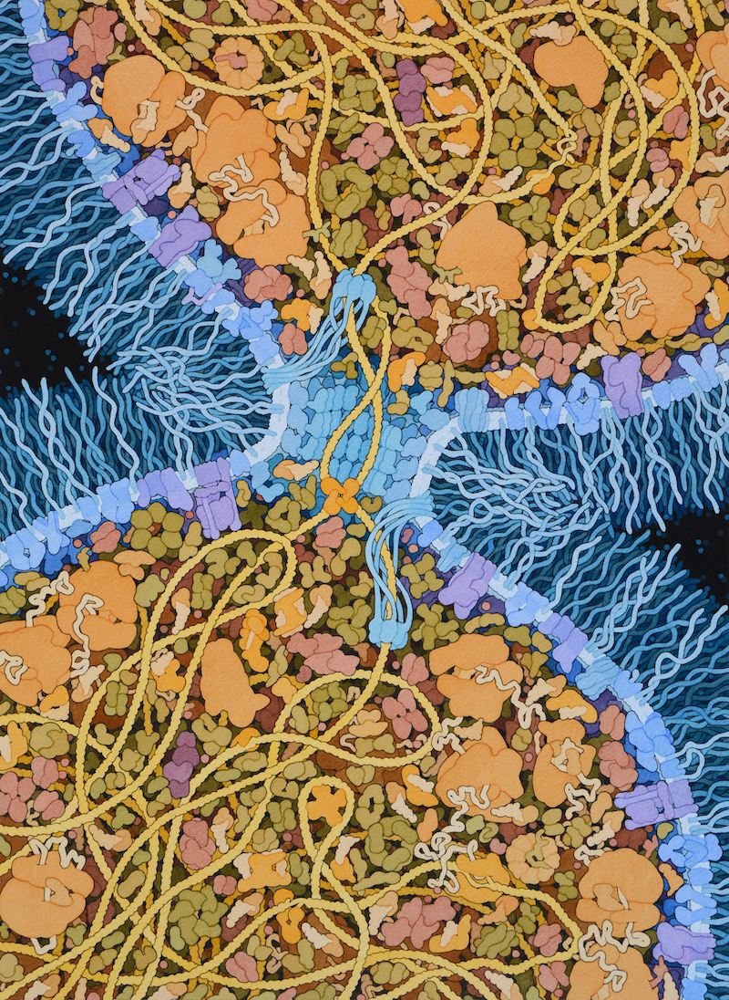

# Overview 
Universal common ancestry (UCA) is a theory that stipulates that all life is genetically related, and is a fundamental premise of modern evolutionary theory. It is universally accepted, supported by evidence from a multitude of fields, often focusing on concordance between phylogeny and paleontologic records of higher taxonomies. 

What is more interesting, are the similarities between higher taxa such as humans or animals, to more primitive forms of life such as bacteria or fungi. Here, similarities are on the molecular level; they contain the same macromolecular machines such as DNA polymerase, ribosomal units (16S). 

# References 
[1] https://www.nature.com/articles/nature09014
